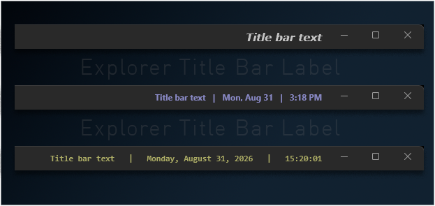

# Explorer Title Bar Label

Add custom text, date and time to the right side of the Windows 11 File Explorer title bar.

## Features

- Custom text, date and time
- Flexible date display
- 12-hour or 24-hour time with optional seconds
- Font, size, weight and color
- Opacity and spacing
- Live updates

## Date and time

Choose the date parts and order you prefer:

- **Weekday:** None, Mon, Monday
- **Day number:** 1, 01
- **Month:** 8, 08, Aug, August
- **Year:** None, 26, 2026
- **Date order:** Month-Day-Year, Day-Month-Year, Year-Month-Day
- **Numeric separator:** `/`, `-`, `.`

Time can use **12-hour or 24-hour format**, with optional seconds.

## Compatibility

This mod uses XAML diagnostics and may conflict with other File Explorer mods that also use XAML diagnostics.
